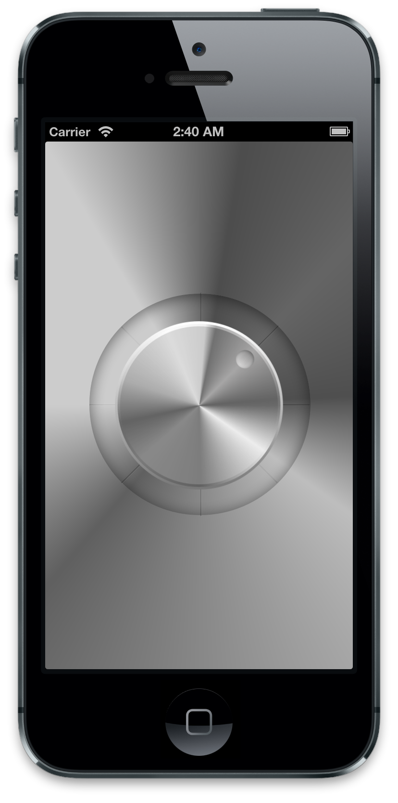

RadialGesture
=============

Implements a UIPanGestureRecognizer for a radial "dial" that snaps to specified positions.

The code uses an `UIPanGestureRecognizer` to track a gesture within a circular area, and supports snapping back to position.